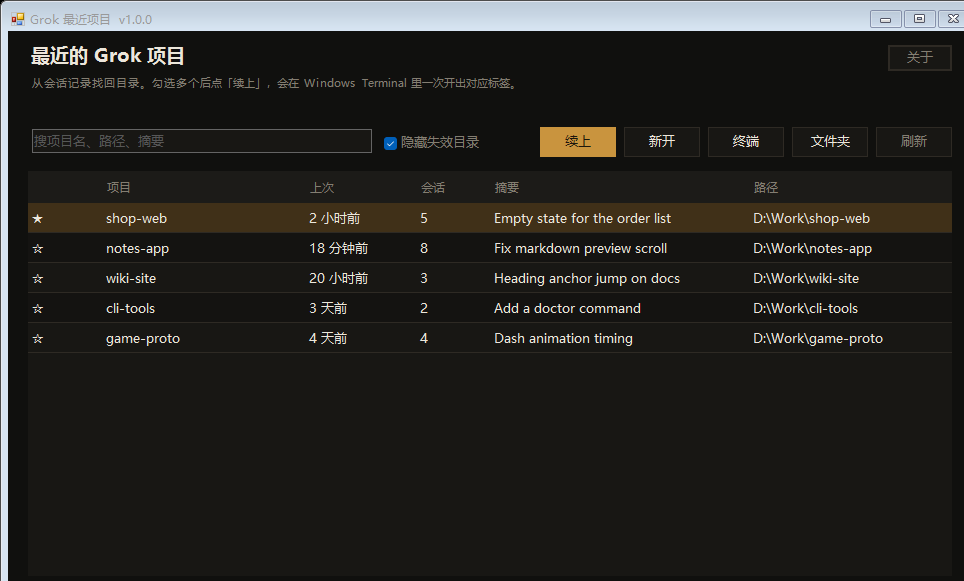

# Grok 最近项目启动器

Windows 小工具：从本机 Grok 会话记录里找回用过的项目目录，勾选后用 Windows Terminal 一次打开。

开过多个 Grok 窗口、关掉之后，不必再一个一个翻文件夹。

> Unofficial. Not affiliated with xAI / Grok.



截图用的是虚构示例数据（`D:\Work\shop-web` 等），不含真实项目路径或会话内容。

[English](#grok-recent-project-launcher)

## 功能

- 列出最近用过 Grok 的目录（按上次活动时间）
- 多选后一次打开多个标签
- **续上** = `grok --cwd <dir> -c`（继续该目录最近一次会话）
- **新开** / **终端** / **资源管理器**
- 搜索、置顶、右键菜单
- 无联网；偏好存在 `%APPDATA%\GrokRecentLauncher\`

## 要求

- Windows 10 / 11
- [Grok CLI](https://x.ai/grok)
- 建议安装 [Windows Terminal](https://aka.ms/terminal)（没有则退回普通窗口）
- Windows PowerShell 5.1（系统自带）

## 使用

1. 克隆本仓库
2. 双击 `【点我】创建桌面图标.bat`
3. 桌面会出现 **Grok 最近项目**
4. 选一个或多个项目 → **续上**（或双击）

也可以直接双击 `启动.bat`。

命令行：

```powershell
powershell -STA -NoProfile -ExecutionPolicy Bypass -File .\GrokRecent.ps1
powershell -NoProfile -ExecutionPolicy Bypass -File .\GrokRecent.ps1 -ListOnly
powershell -NoProfile -ExecutionPolicy Bypass -File .\GrokRecent.ps1 -Version
```

## 隐私

- 只读本机 `~\.grok\sessions\**\summary.json` 的目录、标题、时间
- **不读取** 对话全文、工具日志、`auth.json`、密钥
- **不联网、不上传**
- 置顶名单只保存在本机 AppData，已加入 `.gitignore`

详见 [SECURITY.md](SECURITY.md)。

## 许可

[MIT](LICENSE)

---

# Grok Recent Project Launcher

A tiny Windows app that reads **local** Grok session metadata, lists the folders you recently used, and reopens them in Windows Terminal.

Unofficial. Not affiliated with xAI / Grok.

The screenshot above uses fictional sample rows (`D:\Work\shop-web`, etc.), not real project paths.

## Features

- Recent Grok working directories, newest first
- Multi-select → open several tabs at once
- **Continue** runs `grok --cwd <dir> -c`
- New session / terminal-only / Explorer
- Search, pins, context menu
- Offline. Pins live in `%APPDATA%\GrokRecentLauncher\`

## Requirements

- Windows 10 / 11
- Grok CLI
- Windows Terminal recommended
- Windows PowerShell 5.1

## Usage

1. Clone this repo
2. Run `【点我】创建桌面图标.bat` (or `Install-DesktopShortcut.bat`)
3. Double-click the desktop shortcut **Grok 最近项目**
4. Select folders → **续上** / Continue (or double-click)

```powershell
powershell -STA -NoProfile -ExecutionPolicy Bypass -File .\GrokRecent.ps1
```

## Privacy

Reads only `summary.json` under `~\.grok\sessions` (cwd, title, timestamps). It does not upload data, and it does not open chat transcripts or credentials.

## License

[MIT](LICENSE)
